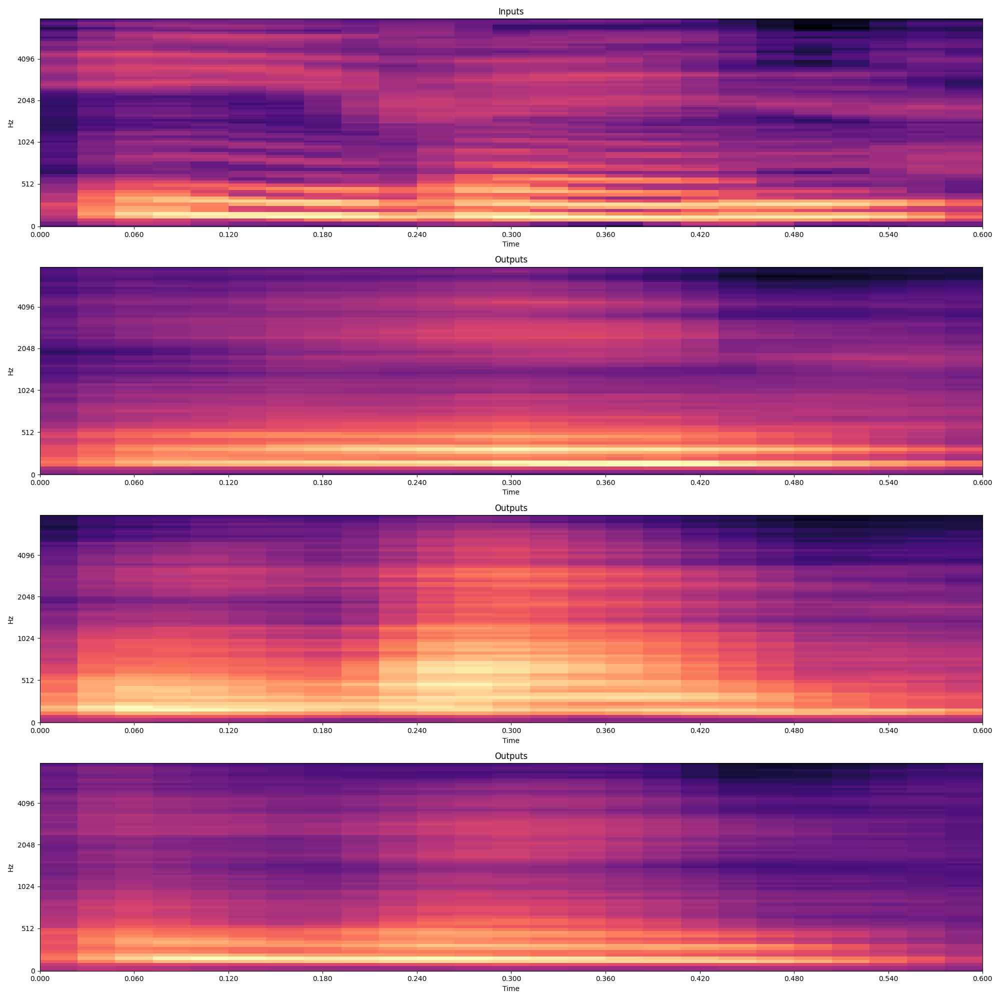

# SED_with_MultiTaskVAE
Sound Event Detector based on Multi-Task Learning Model with Variational Information Bottleneck.
Also includes Sound Event Synthesizer model based on Variational AutoEncoder.

## Installation

1) Install [Gammatone Filterbank Toolkit](https://github.com/detly/gammatone)
2) Install [TensorFlow](https://www.tensorflow.org/install)
3) Install [TensorFlow Probability](https://www.tensorflow.org/probability/install)
4) Install other dependencies via: `pip install -r requirements.txt`

## Sound Event Detector

The Sound Event Detector has been trained on the DCASE Task4 2022 dataset. Pre-trained weights are provided under _event_detector/weights_. Normalization class object containing dataset mean and variance statistics is provided under _event_detector/data_.

### Data preparation

Extract transcripts from metadata for the DCASE dataset. Each audio file transcript contains the audio event labels for that file, as extracted from the metadata.

1) For the training set of synthetic strong-labeled audio files extract transcripts as:

```shell
python utils/create_transcripts.py --path_to_metadata /path/to/dcase/metadata/train.tsv --output_dir /path/to/dcase/synthetic --labels_type strong
```

2) For the training set of real weak-labeled audio files extract transcripts as:

```shell
python utils/create_transcripts.py --path_to_metadata /path/to/dcase/metadata/weak.tsv --output_dir /path/to/dcase/weak --labels_type weak
```

3) For the validation set of real strong-labeled audio files extract transcripts as:

```shell
python utils/create_transcripts.py --path_to_metadata /path/to/dcase/metadata/validation.tsv --output_dir /path/to/dcase/validation --labels_type strong
```

### Evaluation

To obtain the SED evaluation metrics for the trained event detector on the DCASE dataset:

```shell
python evaluate_detector.py --path_to_evaluation_data /path/to/dcase/validation --path_to_normalization_class /event_detector/data/normalization.pickle --path_to_model /event_detector/weights/vae.att.gru.256_size.r_5e-4.batch_size_32.with_audioset_real.h5 --output_dir /path/to/output/dir
```
Then you can also calculate PSDS evaluation metrics by:

```shell
python evaluators/psd_eval.py --groundtruth /path/to/dcase/metadata/validation.tsv --metadata /path/to/dcase/metadata/validation.duration.tsv --predictions /path/to/output/dir
```

### Training

The detector can be trained on the DCASE dataset with:

```shell
python train_event_detector.py --path_to_strongly_labeled_train_data /path/to/dcase/synthetic --path_to_strongly_labeled_test_data /path/to/dcase/validation --path_to_weakly_labeled_train_data /path/to/dcase/weak --path_to_unlabeled_train_data /path/to/dcase/unlabeled --output_dir /path/to/output/dir --model_name experiment_name
```

Real strongly labeled data from Audioset can also be incorporated by adding:

```shell
--path_to_real_strongly_labeled_train_data /path/to/dcase/strong_label_real
```

## Sound Event Synthesizer

The Sound Event Synthesizer has been trained to generate variations of the DCASE Task4 foreground events for the classes of "Speech", "Cat" and "Dog". Pre-trained weights are provided under _synthesizer/weights_. Normalization class object containing dataset mean and variance statistics is provided under _synthesizer/data_.

### Inference

Given some audio file(s), one can generate a given number of variations (or perturbations) of each audio file as:

```shell
python synthesize.py --path_to_audio_files /path/to/audio/files --path_to_normalization_class /synthesizer/data/normalization.pickle --path_to_model /synthesizer/weights/vae.gru.size_512.lr_1e-4.num_latents_32.kld_weight_1e-3.h5 --output_dir /path/to/output/dir --num_perturbations num_perturbations
```

In the output directory, for each input audio file, there will be: 1) a figure with the original mel-spectrogram and the generated mel-spectrograms, 2) Original audio file and the generated audio files. 

An example for an input audio file containing speech and 3 output variations:




